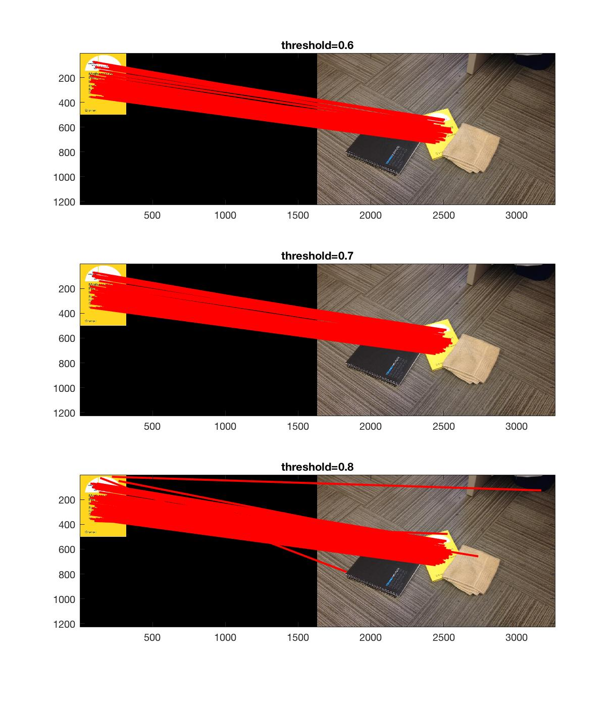
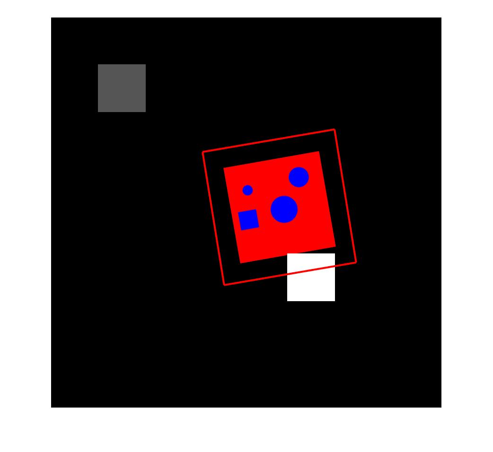

## Question 1
### a)

~~~matlab
% read image
im = imread('building.jpg');
image = im2double(rgb2gray(im));

% compute gradient
[dx, dy] = imgradientxy(image);

% compute Ix2 Iy2 IxIy
Ix2 = dx.^2;
Iy2 = dy.^2;
IxIy = dx.*dy;

% compute Guassian average
sigma = 2;
Ix2 = imgaussfilt(Ix2, sigma);
Iy2 = imgaussfilt(Iy2, sigma);
IxIy = imgaussfilt(IxIy, sigma);

alpha = 0.01;
[height, width] = size(image);
cornerness = zeros(size(image));
for i = 1 : height
    for j = 1 : width
        M =  [Ix2(i,j), IxIy(i,j); IxIy(i,j), Iy2(i,j)];
        % Harris and Stephens
%         cornerness(i,j) = det(M) - alpha * trace(M);
        % Brown et al
        cornerness(i,j) = det(M) / trace(M);
    end
end

figure();
imagesc(cornerness);
~~~

### b)

~~~matlab
threshold = 0.01;
figure();
radii = [5, 10, 20];
for i=1:3
    [Y, X] = q1_b_non_maximum_suppression(cornerness, radii(i), threshold);
    subplot(1,3,i);
    imshow(im);
    hold on;
    axis;
    plot(X, Y, 'r.');
    title(strcat('radius=', num2str(radii(i)))); 
end
function [Y, X] = q1_b_non_maximum_suppression(cornerness, radius, threshold)
    % Create circular mask
    [row, col] = meshgrid(1:(radius * 2));
    mask = sqrt((row - radius).^2+(col - radius).^2) <= radius;
    localMax = ordfilt2(cornerness, radius ^ 2, mask);
    [Y, X] = find(localMax > threshold & cornerness == localMax);
end
~~~

**Explanation:** 
As the radius inreases, the area covered by mask increases, and less local maximum points are selected. Therefore, less corners are detected.

### c)
~~~matlab
im = imread('synthetic.png');
img = mean(double(im), 3);
img = conv2(img, fspecial('gaussian',6,3), 'same');
figure();imagesc(im); axis image; drawnow; hold on;

imgS = img;
k = 1.2;
sigma = 2.0;
s = k.^(1:50)*sigma;
responseLoG = zeros(size(img,1),size(img,2),length(s));
imG = zeros(size(img,1),size(img,2),length(s));

for i = 1:length(s)
    si = s(i);
    hsize = max(25,min(floor(si*3),256));
%     hsize = max(50,floor(si*3));
    LoG = fspecial('log', [hsize hsize], si);
    filteredImg = conv2(imgS,LoG,'same');
    responseLoG(:,:,i)  = (si^2)*filteredImg;
end

threshold = 0.748 * max(abs(responseLoG(:)));

[height, width, scaleIdx] = size(responseLoG);

for i = 2 : scaleIdx-1
    for y = 2 : height-1
        for x = 2 : width-1
            neighbours = abs(responseLoG(y-1:y+1,x-1:x+1,i-1:i+1));
            localMax = max(neighbours(:));
            curr = abs(responseLoG(y,x,i));
            if curr == localMax && localMax > threshold && length(find(neighbours==localMax))==1
                scale = s(i);
                xc = scale*sin(0:0.1:2*pi)+x;
                yc = scale*cos(0:0.1:2*pi)+y;
                plot(xc,yc,'r');drawnow;
            end
        end
    end
end
hold off;

~~~

### d)

**building.jpg** with **Harris corner metrics**

**building.jpg** with **Laplacian of Gaussian**

**synthetic.png** with **Harris corner metrics**

**synthetic.png** with **Laplacian of Gaussian**

**Similarity:** both detect corner, curves and edges.

**Difference:** Harris corner detector identifies the changes at the edge of the shape outline, while Laplacian of Gaussian marks the interest point within the closure of the shapes.

**Exaplanation:** The difference occurs becuase Harris corner detector caculates gradients along x and y direction and it could identify the exact pixel points with the greatest cornerness score change. The Laplacian of Gaussian, however, utilizes Gaussian filters with different scales, and the identified area may not be the exact fit with actual shapes on the image.

## Question 2)
### a)
~~~matlab
img1 = 'book.jpg';
img2 = 'findBook.jpg';

[f1, d1] = q2_a_sift(img1);
[f2, d2] = q2_a_sift(img2);

function [f, d]= q2_a_sift(image)
    im= imread(image);
    img=single(rgb2gray(im));

    [f,d]=vl_sift(img);

    figure();
    imshow(im);
    perm = randperm(size(f,2)) ;
    sel = perm(:) ;
    h1 = vl_plotframe(f(:,sel)) ;
    h2 = vl_plotframe(f(:,sel)) ;
    set(h1,'color','k','linewidth',3) ;
    set(h2,'color','y','linewidth',2) ;
end
~~~

### b)
~~~matlab
% b)
thresholds = [0.6, 0.7, 0.8];
figure;hold on;
for i=1:3
    match = q2_b_matching_algo(d1, d2, thresholds(i));
    % draw imgaes and lines
    im1=imread(img1);
    im2=imread(img2);
    [H1, W1, L1] = size(im1);
    [H2, W2, L2] = size(im2);
    H = max(H1, H2);
    W = max(W1, W2);
    impad1 = padarray(im1, [H-H1,W-W1], 'post');
    impad2 = padarray(im2, [H-H2,W-W2], 'post');
    subplot(3,1,i);
    imagesc([impad1 impad2]);hold on; 

    for j = 1:size(match, 1)
        x1 = f1(1, match(j, 1));
        y1 = f1(2, match(j, 1));
        x2 = f2(1, match(j, 2))+W;
        y2 = f2(2, match(j, 2));
        plot([x1 x2], [y1 y2], 'r', 'LineWidth', 2);
        title(strcat('threshold=', num2str(thresholds(i)))); 

    end
end

function [match] = q2_b_matching_algo(d1, d2, threshold, img1, img2)
    desc1 = transpose(double(d1));
    desc2 = transpose(double(d2));
    dist = pdist2(desc1, desc2);
    [closest, I] = min(dist, [], 2);
    sortedDist = sort(dist, 2, 'ascend');
    secondClosest = sortedDist(:,2);
    match = [];
    ratio = [];
    for i = 1:length(closest)
        phi = closest(i)/secondClosest(i);
        if phi < threshold
            match = cat(1, match, [i, I(i), phi]);
        end
    end    
end
~~~

### c)
~~~matlab
function [affine] = q2_c_affine(f1, f2, match, k)
    sortedMatch = sortrows(match,3);
    P = zeros(2 * k, 6);
    P1 = zeros(2*k,1);
    for i = 1:2:2*k
        matchIdx = (i+1)/2;
        x1 = f1(1, sortedMatch(matchIdx, 1));
        y1 = f1(2, sortedMatch(matchIdx, 1));
        x2 = f2(1, sortedMatch(matchIdx, 2));
        y2 = f2(2, sortedMatch(matchIdx, 2));
        P(i,1) = x1;
        P(i,2) = y1;
        P(i+1,3) = x1;
        P(i+1,4) = y1;
        P(i,5) = 1;
        P(i+1,6) = 1;
        P1(i) = x2;
        P1(i+1) = y2;
    end
    affine = inv(transpose(P) * P) * transpose(P) * P1;
end

% result
%k = 3
affiine = [
    10.5124
   -0.7660
    9.6903
   -0.2075
   23.2152
 -146.7550
 ]

%k = 4
affiine = [
    0.6987
    0.2390
   -0.2128
    0.6900
  675.2114
  500.5707

 ]

 %k = 5
affiine = [
    0.7323
    0.2835
   -0.2409
    0.6528
  659.9976
  513.2714
 ]

 %k = 6
affiine = [
    0.7322
    0.2833
   -0.2433
    0.6501
  660.0628
  514.1480
 ]
~~~

### d)
~~~matlab
img1 = 'book.jpg';
img2 = 'findBook.jpg';

[f1, d1] = q2_a_sift(img1);
[f2, d2] = q2_a_sift(img2);

affine = q2_c_affine(f1,f2,match,4);

q2_d_visualize_affine(img1, img2, affine);

function q2_d_visualize_affine(img1, img2, affine)
    im1 = imread(img1);
    im2 = imread(img2);
    [H1, W1, L1] = size(im1);
    P = [1,1,0,0,1,0;
         0,0,1,1,0,1;
         W1,1,0,0,1,0;
         0,0,W1,1,0,1;
         1,H1,0,0,1,0;
         0,0,1,H1,0,1;
         W1,H1,0,0,1,0;
         0,0,W1,H1,0,1];
    P1 = P * affine;
    figure; imshow(im2); hold on;
    plot([P1(1) P1(3)], [P1(2) P1(4)], 'r', 'LineWidth', 2);
    plot([P1(1) P1(5)], [P1(2) P1(6)], 'r', 'LineWidth', 2);
    plot([P1(7) P1(5)], [P1(8) P1(6)], 'r', 'LineWidth', 2);
    plot([P1(7) P1(3)], [P1(8) P1(4)], 'r', 'LineWidth', 2);

end
~~~

### e)
~~~matlab
imgC1 = 'colourTemplate.png';
imgC2 = 'colourSearch.png';
[fC1, dC1] = q2_e_sift_colour(imgC1);
[fC2, dC2] = q2_e_sift_colour(imgC2);
matchC = q2_b_matching_algo(dC1, dC2, 0.5);
affineC = q2_c_affine(fC1,fC2,matchC,4);
q2_d_visualize_affine(imgC1, imgC2, affineC);

function [f,d] = q2_e_sift_colour(img)
    im=rgb2hsv(imread(img));
    hue = single(im(:,:,1));
    [f,d]=vl_sift(hue);
end
~~~

**Approach:** convert RGB matrix into HSV (Hue-Saturation-Value) and perform the same procedure with its Hue channel.

**Explanation:** In HSV model, hue channel stores color (chroma) information in separation from the image intensity. With only hue channel input to SIFT, it works in the same way as the grayscale input.