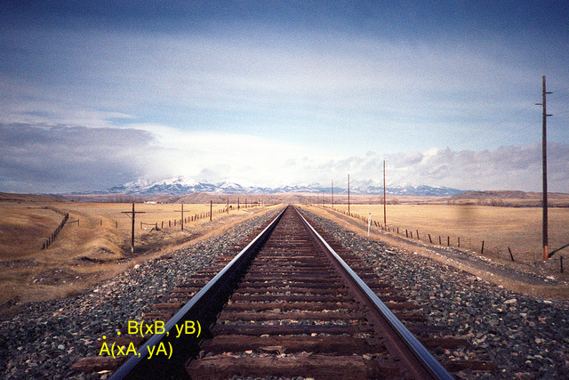
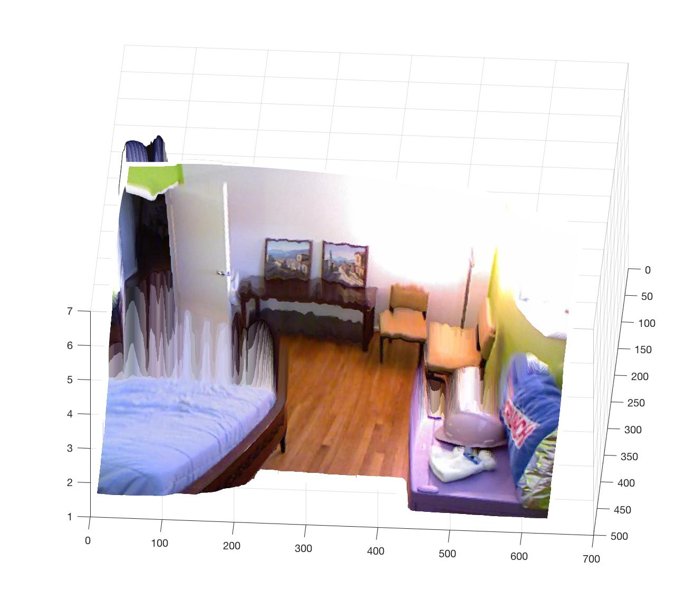

## Question 1

From Google: the size of a Canadian 5-dollar bill is 152.4 mm x	69.85 mm

~~~matlab
im = double(rgb2gray(imread('shoe.jpg')));
billCorners = [0, 0;
    0, 152.4;
    69.85, 152.4;
    69.85, 0];
figure; imagesc(im);colormap gray;

bilCornersImg = ginput(4);
transform = fitgeotrans(bilCornersImg, billCorners, 'projective');
transformed = imwarp(im, transform, 'bicubic', 'fill', 0);
figure; imagesc(transformed); colormap gray; hold on;

% draw lines and calculate length/width
line1 = ginput(2);
x1 = line1(:,1);
y1 = line1(:,2);
plot(x1, y1, 'y-');
m1 = midpoint(1,line1.');
text(m1(1), m1(2), strcat('\leftarrow ', num2str(pdist(line1, 'euclidean') / 10, 3), ' cm'), 'Color', 'yellow', 'FontSize', 14); 

line2 = ginput(2);
x2 = line2(:,1);
y2 = line2(:,2);
plot(x2, y2, 'r--');
m2 = midpoint(1,line2.');
text(m2(1), m2(2), strcat('\leftarrow ', num2str(pdist(line2, 'euclidean') / 10, 3), ' cm'), 'Color', 'red', 'FontSize', 14); 

~~~

## Question 2

### a)

~~~matlab
im = double(rgb2gray(imread('mugShot.jpg')));
% a) test case
% from https://www.mathworks.com/discovery/affine-transformation.html
translation = [1, 0, 0;
               0, 1, 0;
               50, 50, 1];
scale = [.5, 0, 0;
         0, .7, 0;
         0, 0, 1];
shear = [1, 0.2, 0;
         0.1, 1, 0;
         0, 0, 1];
rotation = [cos(45*pi/180), sin(45*pi/180), 0;
            -sin(45*pi/180), cos(45*pi/180), 0;
            0, 0, 1];
A = translation * scale * shear * rotation;
tform = affine2d(A);
testIm = imwarp(im, tform, 'bicubic', 'fill', 0);
figure; 
subplot(1,2,1);imagesc(im); title('original image'); colormap gray;hold on;

% adopted;
[f1,d1]=vl_sift(single(im));
[f2,d2]=vl_sift(single(testIm));
match = matching_algo(d1, d2, 0.8);

% run ransac
affine = ransac(f1, f2, match, 50);
visualize_affine(im, testIm, affine);

function result = ransac(f1, f2, match, iterations)
    maxInliner = 0;
    result = zeros(1,1);
    for i = 1 : iterations
        k = 5;
        [matchSize, ~] = size(match);
        idx = randperm(matchSize, k);

        P = zeros(2 * k, 6);
        P1 = zeros(2*k,1);
        for j = 1:2:2*k
            matchIdx = idx((j+1)/2);
            x1 = f1(1, match(matchIdx, 1));
            y1 = f1(2, match(matchIdx, 1));
            x2 = f2(1, match(matchIdx, 2));
            y2 = f2(2, match(matchIdx, 2));
            P(j,1) = x1;
            P(j,2) = y1;
            P(j+1,3) = x1;
            P(j+1,4) = y1;
            P(j,5) = 1;
            P(j+1,6) = 1;
            P1(j) = x2;
            P1(j+1) = y2;
        end

        affine = inv(transpose(P) * P) * transpose(P) * P1;
        A = [affine(1),  affine(2), affine(4);
             affine(4),  affine(4), affine(6)]

        inliner = 0;
        for j = 1:matchSize
            point1 = [f1(1, match(j, 1)); f1(2, match(j, 1)); 1];
            point2 = [f2(1, match(j, 2)), f2(2, match(j, 2))];
            A_point1 = A * point1;
            dist = pdist2(point2, ctranspose(A_point1));
            if dist < 3
                inliner = inliner + 1;
            end
        end
        if inliner > maxInliner
            maxInliner = inliner;
            result = affine;
        end
        
    end
end

function [match] = matching_algo(d1, d2, threshold)
    desc1 = transpose(double(d1));
    desc2 = transpose(double(d2));
    dist = pdist2(desc1, desc2);
    [closest, I] = min(dist, [], 2);
    sortedDist = sort(dist, 2, 'ascend');
    secondClosest = sortedDist(:,2);
    match = [];
    for i = 1:length(closest)
        phi = closest(i)/secondClosest(i);
        if phi < threshold
            match = cat(1, match, [i, I(i), phi]);
        end
    end    
end

function visualize_affine(img1, img2, affine)
    im1 = img1;
    im2 = img2;
    [H1, W1, ~] = size(im1);
    P = [1,1,0,0,1,0;
         0,0,1,1,0,1;
         W1,1,0,0,1,0;
         0,0,W1,1,0,1;
         1,H1,0,0,1,0;
         0,0,1,H1,0,1;
         W1,H1,0,0,1,0;
         0,0,W1,H1,0,1];
    P1 = P * affine;
    subplot(1,2,2); imagesc(im2);colormap gray; hold on;
    plot([P1(1) P1(3)], [P1(2) P1(4)], 'r', 'LineWidth', 2);
    plot([P1(1) P1(5)], [P1(2) P1(6)], 'r', 'LineWidth', 2);
    plot([P1(7) P1(5)], [P1(8) P1(6)], 'r', 'LineWidth', 2);
    plot([P1(7) P1(3)], [P1(8) P1(4)], 'r', 'LineWidth', 2);

end
~~~

### b)

~~~matlab
imageFiles = dir('shredded/*.png');
imageNum = length(imageFiles);
shreddedImg = cell(imageNum,1);
for i = 1:imageNum
    cut = double(rgb2gray(imread(strcat('shredded/', imageFiles(i).name))));
    shreddedImg(i) = mat2cell(cut, size(cut,1), size(cut,2));
end

permutations = perms(1:imageNum);
minMeanResidualSSD = intmax;
reassembledIm = 0;
for i = 1:2
    fprintf('testing permutation #%i\n', i);
    order = permutations(i,:);
    reassembled = zeros(size(im));
    leftEdge = 1;
    for j = 1:imageNum
        cut = cell2mat(shreddedImg(order(j)));
        cutW = size(cut,2);
        reassembled(:,leftEdge:leftEdge+cutW-1) = cut;
        leftEdge = leftEdge + cutW;
    end
    [f3,d3]=vl_sift(single(reassembled));
    match = matching_algo(d1, d3, 0.8);
    meanResidualSSD = ransacReassemble(f1, f3, match, 50);
    if meanResidualSSD < minMeanResidualSSD
        minMeanResidualSSD = meanResidualSSD;
        reassembledIm = reassembled;
    end
end

figure; imagesc(reassembledIm); colormap gray;

function minMeanResidualSSD = ransacReassemble(f1, f2, match, iterations)
    minMeanResidualSSD = intmax;
    
    for i = 1 : iterations
        k = 5;
        [matchSize, ~] = size(match);
        idx = randperm(matchSize, k);

        P = zeros(2 * k, 6);
        P1 = zeros(2*k,1);
        for j = 1:2:2*k
            matchIdx = idx((j+1)/2);
            x1 = f1(1, match(matchIdx, 1));
            y1 = f1(2, match(matchIdx, 1));
            x2 = f2(1, match(matchIdx, 2));
            y2 = f2(2, match(matchIdx, 2));
            P(j,1) = x1;
            P(j,2) = y1;
            P(j+1,3) = x1;
            P(j+1,4) = y1;
            P(j,5) = 1;
            P(j+1,6) = 1;
            P1(j) = x2;
            P1(j+1) = y2;
        end

        affine = inv(transpose(P) * P) * transpose(P) * P1;
        A = [affine(1),  affine(2), affine(4);
             affine(4),  affine(4), affine(6)]

        residualSum = 0;
        for j = 1:matchSize
            point1 = [f1(1, match(j, 1)); f1(2, match(j, 1)); 1];
            point2 = [f2(1, match(j, 2)), f2(2, match(j, 2))];
            point2Fitted = A * point1;
            dist = pdist2(point2, ctranspose(point2Fitted));
            residualSum = residualSum + dist ^ 2;
        end
        meanResidualSSD = residualSum / matchSize;
        if meanResidualSSD < minMeanResidualSSD
            minMeanResidualSSD = meanResidualSSD;
        end
    end
end
~~~

## Question 3

### a)

Given $$K, $R$, $t$, also we know the projection matrix (denoted by $\bold{Proj}$):

$$ \mathbf{Proj} = \begin{bmatrix} 1 & 0 & 0 & 0 \\ 0 & 1 & 0 & 0 \\ 0 & 0 & 1 & 0  \end{bmatrix}$$

From the projection equation:

$$  \begin{bmatrix} x \\y \\ 1 \end{bmatrix}= \mathbf{K} \cdot \mathbf{Proj} \cdot \mathbf{R} \cdot \mathbf{t} \begin{bmatrix} X \\ Y \\ Z \\1  \end{bmatrix}$$

We get:

$$  \begin{bmatrix} X \\ Y \\ Z \\1  \end{bmatrix} = \mathbf{t}^{-1} \cdot \mathbf{R}^{-1} \cdot \mathbf{Proj}^{-1} \cdot \mathbf{K}^{-1} \cdot \begin{bmatrix} x \\y \\ 1 \end{bmatrix}$$

Choose two points of the adjacent railway ties from picture, as shown in picture, and get pixel coordinates $(x_A, y_A)$, $(x_B, y_B)$.

Then we can caculate real world coordinates $(X_A, Y_A, Z_A)$, $(X_B, Y_B, Z_B)$.

The distance is $\sqrt{ (X_A - X_B)^2 + (Z_A - Z_A)^2}$ since it can be assumed that booth ties are on the same level.

### b)

The length of the yellow line is 290 pixels. The lower part of the yellow (from red dot) is 146 pixels, and the upper part is 144 pixels.

The lower part corresponds to the camera height from ground. So using the properties of similar triangles, the height of the man is 

$$\text{height} = 95 \text{ cm} \times \dfrac{290 \text{ px}}{146 \text{ px}} = 188.7 \text{ cm}$$

## Question 4

### a)

$$ \mathbf{K} = \begin{bmatrix} 721.5 & 0 & 609.6\\ 0 & 721.5 & 172.9 \\ 0 & 0 & 1  \end{bmatrix}$$

###  b)

Assume the camera coordinate using millimeter as unit.

Assume the camera is the origin point.

Since the camera is 1.7 meters above ground, the ground plane is 1.7 meters (1700 millimeters) below the camera. So the equation of the ground plane is

$$ y = -1700$$

### c)

Assuming the point lies on the ground, the 3D location is 

$$\mathbf{Q}=(X, -1700, Z)$$

Then the 2D location, relative to the principal point, is 

$$\mathbf{q_p}=(\dfrac{f\cdot X}{Z}, \dfrac{f\cdot X}{Z})$$

Then the 2D location, relative to the origin, is 

$$\mathbf{q_p}=(x, y)=(\dfrac{f\cdot X}{Z} + p_x, \dfrac{f\cdot Y}{Z}+p_y) = (\dfrac{721.5\cdot X}{Z} + 609.6, \dfrac{721.5\cdot -1770}{Z}+172.9) = (\dfrac{721.5\cdot X}{Z} + 609.6, \dfrac{-1277055}{Z}+172.9)$$

## Bonus

a)

