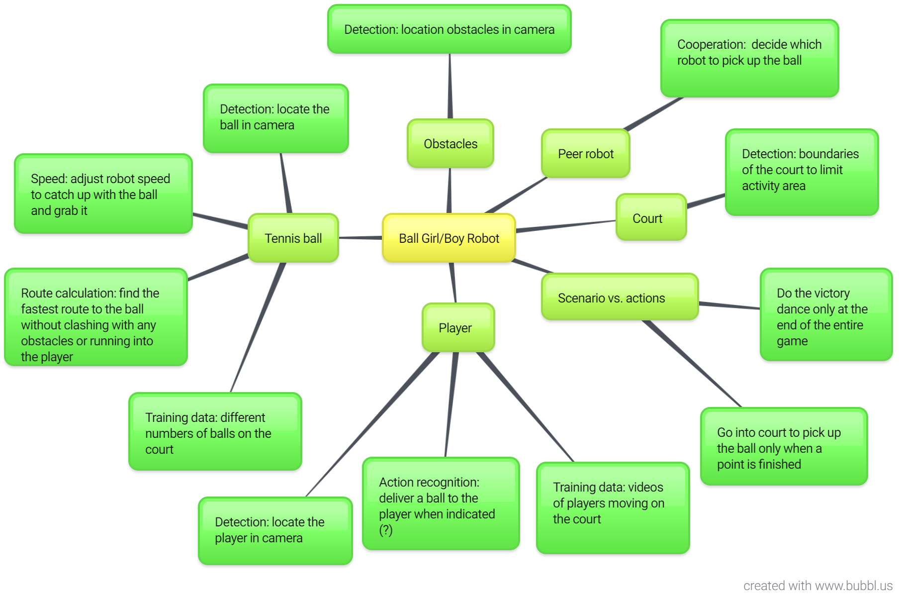
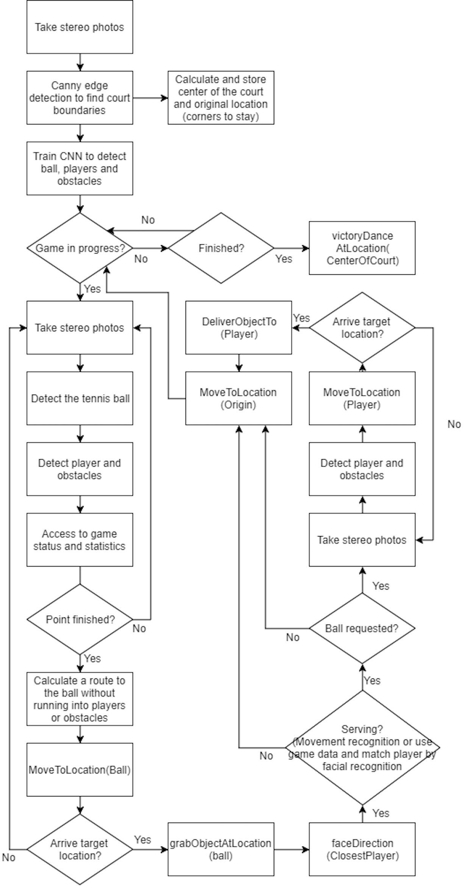
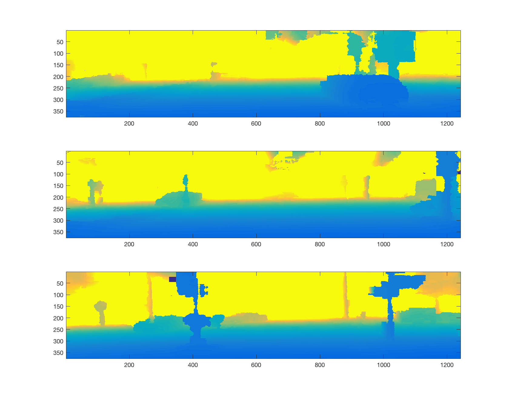
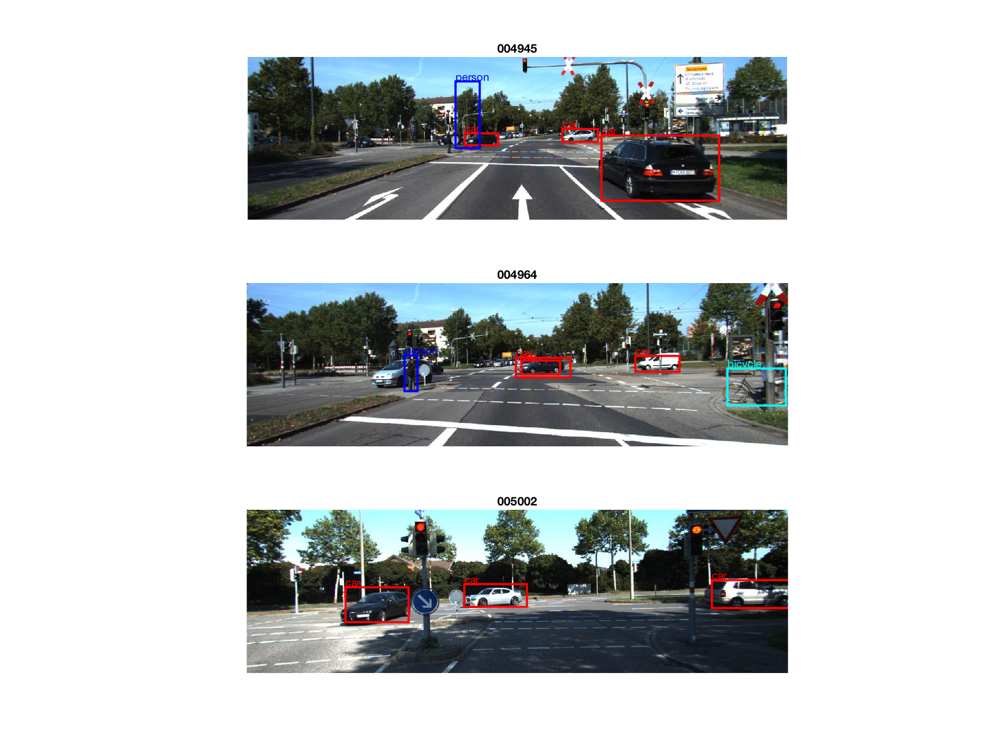
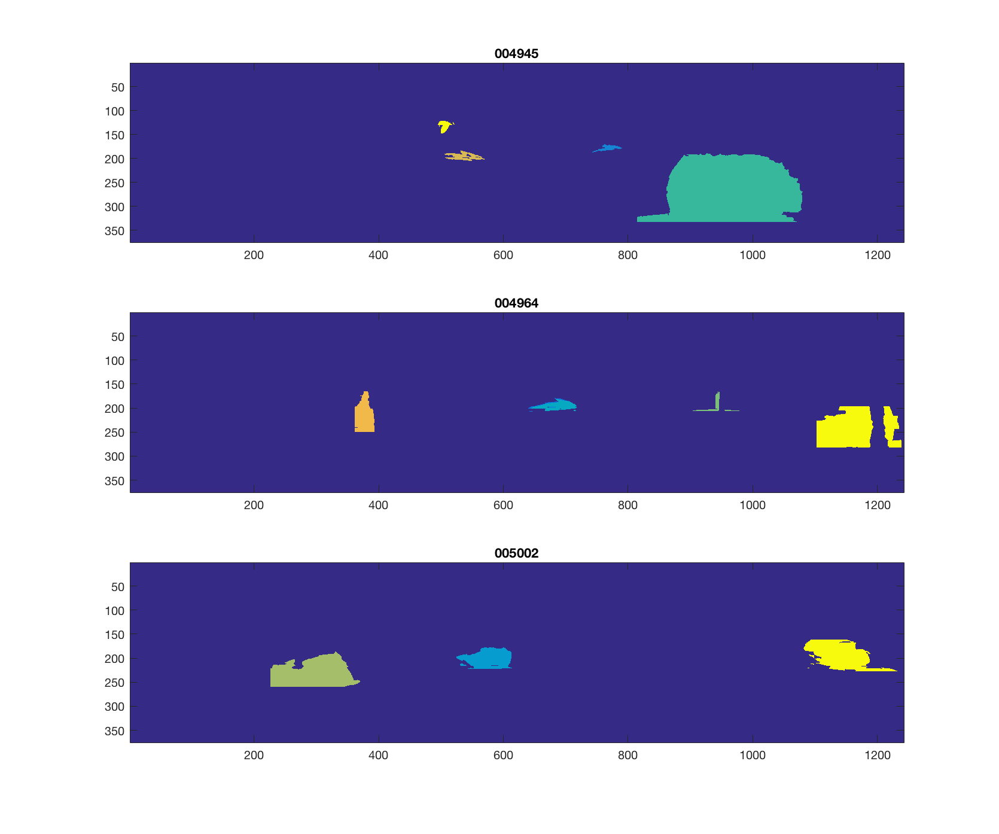

## Question 1
### a)



### b)



### c)

~~~matlab

function ballRobot = trainCourt(courtImg)
    data = load(courtImg);
    for i=1:n
        label = CNN(data.img(i));
        while labels != data.labels
            BackPropagation();
        end
    end
end
~~~

~~~matlab

function run(ballRobot, gameStart, gameFinished)

    if gameStart
        while inGame
            photo = takeStereoPhoto();
            ball = findBallLocation();
            players = findPlayerLocation();
            obstacles = findObastaclesLocations;
            
            game = loadGameProgressAndStats();
            if game.pointFinished

                ballRobot.route = calculateRouteToBall(ball, players, obstacles);
                ballRobot.MoveToLocation(ball);

                if ballRobot.arrive(ball)

                    ballRobot.grabObjectAtLocation(ball);
                    player = closest(players);
                    ballRobot.faceDirection(player);

                    if game.serving(player)

                        photo2 = takeStereoPhoto();
                        analyzeMovement(photo2);

                        if requestBall
                            ballRobot.route = calculateRouteToPlyaer(players, obstacles);
                            ballRobot.MoveToLocation(ball);
                        else
                            ballRobot.MoveToLocation(origin);
                        end
                        
                    end
                end
            end
        end
    end

    if gameFinished
        ballRobot.victoryDanceAtLocation(CenterOfCourt);
    end
end
~~~

## Question 2

### a)
~~~matlab

imageIds = getData([], 'test', 'list');

figure();

for n = 1:3
    id = char(imageIds.ids(n));
    
    calib = getData(id, 'test', 'calib');
    disparity = getData(id, 'test', 'disp');
    disparity = double(disparity.disparity);

    [row, col] = size(disparity);
    depth = zeros(row, col);
    
    for i = 1:row
        for j = 1:col
            depth(i,j) = (calib.f - calib.baseline) / disparity(i,j);
        end
    end

    subplot(3, 1, n);
    image(depth);
end
~~~


### b)

~~~matlab

labels = [{'car'}, {'person'}, {'bicycle'}];
threshold = [.1, .3, .9];
detectors = struct('car', 2, 'person', 3, 'bicycle', 3);
color = ['r', 'b', 'c'];

for i = 1:3
    data = getData([], [], sprintf('detector-%s', char(labels(i))));
    detectors.(labels{i}) = data.model;
end

imgIds = getData([], 'test', 'list');
imgIds = imgIds.ids;

for i = 1:size(imgIds)
    
    imdata = getData(char(imgIds(i)), 'test', 'left');
    im = imdata.im;
    f = 1.5;
    imr = imresize(im,f);
    
    result = struct('car', 6, 'person', 6, 'bicycle', 6);
    
    fprintf('Testing image #%i\n', i);

    for j = 1:3
        fprintf('    For target object - %s\n' , char(labels(j)));
        fprintf('       running the detector, may take a few seconds...\n');
        tic;
        model = detectors.(labels{j});
        [ds, bs] = imgdetect(imr, model, model.thresh*threshold(j));
        % you may need to reduce the threshold if you want more detections
        e = toc;
        fprintf('       finished! (took: %0.4f seconds)\n', e);
        nms_thresh = 0.5;
        top = nms(ds, nms_thresh);
        if model.type == model_types.Grammar
            bs = [ds(:,1:4) bs];
        end
        if ~isempty(ds)
            % resize back
            ds(:, 1:end-2) = ds(:, 1:end-2)/f;
            bs(:, 1:end-2) = bs(:, 1:end-2)/f;
        end;
        ds = ds(top, :);
        result.(labels{j}) = ds;
    end
    
    save(sprintf('../results/%s.mat', string(imgIds(i))), 'result');
    
end
~~~

The following is added to ```getData```

~~~matlab

case {'result'}
        file = fullfile(RESULT_DIR, sprintf('%s.mat', imname));
        data = load(file);
~~~

### c)
~~~matlab

imageIds = getData([], 'test', 'list');

labels = [{'car'}, {'person'}, {'bicycle'}];
color = ['r', 'b', 'c'];

figure();

for i = 1:3
    id = char(imageIds.ids(i));
    result = getData(id,[],'result');
    result = result.result;
    imdata = getData(id, 'test', 'left');
    im = imdata.im;
    subplot(3,1,i); imshow(im); title(id); hold on;
    for j = 1:3
        ds = result.(labels{j});
        for k = 1:size(ds, 1)
            x = ds(k, 1);
            y = ds(k, 2);
            w = ds(k, 3) - ds(k, 1);
            h = ds(k, 4) - ds(k, 2);
            rectangle('Position',[x y w h], 'EdgeColor', color(j), 'LineWidth', 2);
            text(x, y-12, char((labels{j})), 'color', color(j));
            hold on;
        end
    end
end
~~~



### d)

~~~matlab

imageIds = getData([], 'test', 'list');
imageIds = imageIds.ids;

labels = [{'car'}, {'person'}, {'bicycle'}];

for i = 1:size(imageIds)
    id = char(imageIds(i));
    calib = getData(id, 'test', 'calib');
    
    % from part a) - calcualte depth first
    disparity = getData(id, 'test', 'disp');
    disparity = double(disparity.disparity);

    [row, col] = size(disparity);
    depth = zeros(row, col);
    
    for j = 1:row
        for k = 1:col
            depth(j,k) = (calib.f - calib.baseline) / disparity(j,k);
        end
    end
    
    % find center of mass
    
    result = getData(id,[],'result');
    result = result.result;
    px = calib.K(1,3);
    py = calib.K(2,3);
    f = calib.f;
    
    car = zeros(size(result.car, 1), 3);
    person = zeros(size(result.person, 1), 3);
    bicycle = zeros(size(result.bicycle, 1), 3);
    
    location3d = struct('car', car, 'person', person, 'bicycle', bicycle);
    
    for j = 1:3
        ds = result.(labels{j});
        location = zeros(size(ds, 1), 3);
        for k = 1:size(ds, 1)
            xcent = (ds(k, 3) + ds(k, 1)) / 2;
            ycent = (ds(k, 4) + ds(k, 2)) / 2;
            z = depth(round(ycent), round(xcent));
            x = (xcent - px) * z / f;
            y = (ycent - py) * z / f;
            location(k,:) = [x, y, z];
        end
        location3d.(labels{j}) = location;
    end
    
    save(sprintf('../results/%s_3d.mat', id), 'location3d');
end
~~~

The following is added to ```getData```

~~~matlab

case {'object-location'}
        file = fullfile(RESULT_DIR, sprintf('%s_3d.mat', imname));
        data = load(file);
~~~

### e)

~~~matlab

imageIds = getData([], 'test', 'list');
imageIds = imageIds.ids;

labels = [{'car'}, {'person'}, {'bicycle'}];

for n = 1:size(imageIds)
    id = char(imageIds(n));
    calib = getData(id, 'test', 'calib');
    
    % from part a) - calcualte depth first
    disparity = getData(id, 'test', 'disp');
    disparity = double(disparity.disparity);
    [row, col] = size(disparity);
    depth = zeros(row, col);
    for i = 1:row
        for j = 1:col
            depth(i,j) = (calib.f - calib.baseline) / disparity(i,j);
        end
    end
    
    % find segmentations
    segmentation = zeros(row, col);
    object = 1;
    result = getData(id,[],'result');
    result = result.result;
    objectLocation = getData(id, [], 'object-location');
    objectLocation = objectLocation.location3d;
    px = calib.K(1,3);
    py = calib.K(2,3);
    f = calib.f;
    
    for j = 1:3
        ds = result.(labels{j});
        location = objectLocation.(labels{j});
        for k = 1:size(ds, 1)
            com = location(k,:);
            left = max(1, floor(ds(k,1)));
            right = min(col, ceil(ds(k,3)));
            top = max(1, floor(ds(k,2)));
            bottom = min(row, ceil(ds(k,4)));
            for x = left:right
                for y = top:bottom
                    z = depth(y, x);
                    x1 = (x - px) * z / f;
                    y1 = (y - py) * z / f;
                    if (norm(com - [x1, y1, z]) <= 3)
                        segmentation(y, x) = object;
                    end
                end
            end
            object = object + 1;
        end
    end
    save(sprintf('../results/%s_seg.mat', id), 'segmentation');
end

% visualize first three images
figure();
for i=1:3
    id = char(imageIds(i));
    file = fullfile(sprintf('../results/%s_seg.mat', id));
    segmentation = load(file);
    segmentation = segmentation.segmentation;
    subplot(3,1,i); imagesc(segmentation); title(id); hold on;
end
~~~



### f)

~~~matlab

imageIds = getData([], 'test', 'list');
imageIds = imageIds.ids;

labels = [{'car'}, {'person'}, {'bicycle'}];

for i = 1:size(imageIds)
    id = char(imageIds(i));
    objectLocation = getData(id, [], 'object-location');
    objectLocation = objectLocation.location3d;
    file = fopen(sprintf('../results/%s_info.txt', id), 'a+');
    fprintf(file, 'In the scene #%s\n', id);
    for j = 1:3
        location = objectLocation.(labels{j});
        count = size(location, 1);
        fprintf(file, 'There are %i %s(s)\n', count, labels{j});
        if count > 0
            x = 0;
            closest = intmax;
            for k = 1:size(location)
                distance = norm(location(k,:));
                if distance < closest
                    closest = distance;
                    x = location(k,1);
                end
            end
            if x >= 0
                txt = 'to your right';
            else 
                txt ='“to your left';
            end;
            fprintf(file, 'The closest one is a %s %0.1f meters %s \n', labels{j}, x, txt); 
            fprintf(file, 'It is %0.1f meters away from you \n', closest);
        end
    end
end
~~~

For the first three images:

~~~

In the scene #004945
There are 3 car(s)
The closest one is a car 6.0 meters to your right 
It is 14.2 meters away from you 
There are 1 person(s)
The closest one is a person -20.3 meters “to your left 
It is 144.8 meters away from you 
There are 0 bicycle(s)

~~~

~~~

In the scene #004964
There are 3 car(s)
The closest one is a car 24.2 meters to your right 
It is 58.0 meters away from you 
There are 1 person(s)
The closest one is a person -10.0 meters “to your left 
It is 33.0 meters away from you 
There are 1 bicycle(s)
The closest one is a bicycle 15.8 meters to your right 
It is 26.0 meters away from you 

~~~

~~~

In the scene #005002
There are 3 car(s)
The closest one is a car -12.5 meters “to your left 
It is 32.0 meters away from you 
There are 0 person(s)
There are 0 bicycle(s)

~~~

## Extra

### a)

~~~python

loadImage()
objects = detectObjects() # as in Q2 part b
COM_of_objects = findObjectLocations(objects) # as in Q2 part d
segmentations = sgementImage(objects, COM_of_objects) # as in Q2 part e

onTopOf = [] # list of (a, b), a is on top of b

for obj1 in objects
    com1 = COM_of_objects(obj1) # center of mass of obj1 in [x, y, z]
    for obj2 in objects
        if obj1 != obj2

            com2 = COM_of_objects(obj2)

            # If an object is sitting on top of another object 
            # they must be in contact, shown on image to some extent
            # and the center of mass should be close in depth
            if segmentaions(obj1) is in touch with segmentaions(obj2)
                and obj1.z in range(obj2.z-margin, obj2.z+margin)

                # Compare the y in the real-world coordinate
                # to determine with object is on top
                
                if (obj1.y > obj2.y)
                    onTopOf.append(obj1.y, obj2.y)
                else
                    onTopOf.append(obj2.y, obj1.y)
~~~