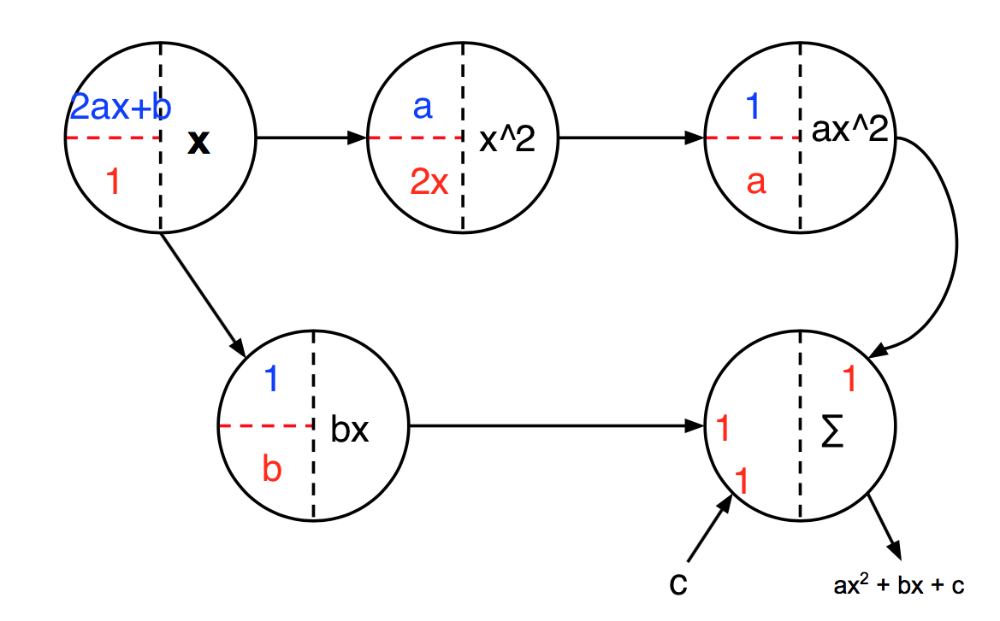

# Question 1

## 1.1
~~~python
tracks = []

for frame_id in range(start_frame, end_frame):
  current_image, current_detections = load_image_and_detections(frame_id)

  next_image, next_detections = load_image_and_detections(frame_id + 1)

  # sim has as many rows as len(current_detections) and as many columns as
  # len(next_detections).
  # sim[k, t] is the similarity between detection k in frame i, and detection
  # t in frame j.
  # sim[k, t] == 0 indicates that k and t should probably not be the same track.
  sim = compute_similarity(current_detections, next_detections,
                           current_image, next_image)

  while sim.size != 0:

    track_index = np.unravel_index(sim.argmax(), sim.shape)
    current_det = current_detections[track_index[0]].tolist()
    current_det[4] = frame_id
    next_det = next_detections[track_index[1]].tolist()
    next_det[4] = frame_id + 1
    
    if sim[track_index] != 0:
      added = False
      for track in tracks:
        if current_det in track:
          track.append(next_det)
          added = True
          break
      if not added:
        tracks.append([current_det, next_det])

    sim = np.delete(sim, track_index[0], axis=0)
    sim = np.delete(sim, track_index[1], axis=1)
    current_detections = np.delete(current_detections, track_index[0], axis=0)
    next_detections = np.delete(next_detections, track_index[1], axis=0)
~~~

## 1.2
~~~python
tracks = [track for track in tracks if len(track) > 2]
print(len(tracks))
color_counter = 0
colors = ['black', 'green', 'red', 'yellow', 'blue', 'white', 'cyan']
for track in tracks:
  
  if len(track) < 5:
    continue
  color_counter += 1

  for detection in track:

    image_path = os.path.join(TRACKS_DIR, '%06d.jpg' % detection[4])
    image = Image.open(image_path).convert("RGBA")

    draw = ImageDraw.Draw(image)
    draw.rectangle([(detection[0], detection[1]), (detection[2], detection[3])], outline=colors[color_counter])
    image.save(image_path, "JPEG")
~~~

## 1.3

* Train the DPM model with more image data
* Tune the parameter by trial-and-error

## 1.4

* Find court coordinates and actual dimension
* Use affine transformation to convert the player coordinates to actual location
* Calculate speed over frame (or seconds)

# Question 2

## 2.1

$$\begin{aligned}
\mathcal{L}(\mathbf{w}, b) & = -\dfrac{1}{M} \sum^M_{i=1}[y_i \log(h(\mathbf{w}^\intercal \mathbf{x}_i+b)) + (1-y_i) \log(1-h(\mathbf{w}^\intercal \mathbf{x}_i+b))]  \\
& = -\dfrac{1}{M} \sum^M_{i=1}[y_i \log(\dfrac{1}{1+  e^{-(\mathbf{w}^\intercal \mathbf{x}_i+b)}})+ (1-y_i) \log (1-\dfrac{1}{1+  e^{-(\mathbf{w}^\intercal \mathbf{x}_i+b)}})] \\
& = -\dfrac{1}{M} \sum^M_{i=1}[y_i \log(\dfrac{1}{1+  e^{-(\mathbf{w}^\intercal \mathbf{x}_i+b)}})+ (1-y_i) \log (\dfrac{e^{-(\mathbf{w}^\intercal \mathbf{x}_i+b)}}{1+  e^{-(\mathbf{w}^\intercal \mathbf{x}_i+b)}})] \\
& = -\dfrac{1}{M} \sum^M_{i=1}[-y_i \log({1+  e^{-(\mathbf{w}^\intercal \mathbf{x}_i+b)}})+ (1-y_i) \{\log ({e^{-(\mathbf{w}^\intercal \mathbf{x}_i+b)}}) - \log ({1+  e^{-(\mathbf{w}^\intercal \mathbf{x}_i+b)}})\}] \\
& = -\dfrac{1}{M} \sum^M_{i=1}[-y_i \log({1+  e^{-(\mathbf{w}^\intercal \mathbf{x}_i+b)}})+ (1-y_i) (-(\mathbf{w}^\intercal \mathbf{x}_i+b)) - (1-y_i) \log ({1+  e^{-(\mathbf{w}^\intercal \mathbf{x}_i+b)}})] \\
& = -\dfrac{1}{M} \sum^M_{i=1}[(1-y_i) (-(\mathbf{w}^\intercal \mathbf{x}_i+b)) - \log ({1+  e^{-(\mathbf{w}^\intercal \mathbf{x}_i+b)}})] \\
& =\dfrac{1}{M} \sum^M_{i=1}[(1-y_i) (\mathbf{w}^\intercal \mathbf{x}_i+b) + \log ({1+  e^{-(\mathbf{w}^\intercal \mathbf{x}_i+b)}})] \\
\end{aligned}$$
 

Let $\mathbf{x}_i^{(j)}$ be the $j$-th feature descriptor of sample $\mathbf{x}_i$ . 

$$ \begin{aligned}
\dfrac{\partial\mathcal{L}}{\partial w_1} & = \dfrac{1}{M} \sum^M_{i=1}[(1-y_i)\cdot\mathbf{x}_i^{(1)} - \dfrac{\mathbf{x}_i^{(1)} \cdot e^{-(\mathbf{w}^\intercal \mathbf{x}+b)}}{1+  e^{-(\mathbf{w}^\intercal \mathbf{x}+b)}}] \\
& = \dfrac{1}{M} \sum^M_{i=1}\mathbf{x}_i^{(1)} [(1-y_i)- \dfrac{ e^{-(\mathbf{w}^\intercal \mathbf{x}+b)}}{1+  e^{-(\mathbf{w}^\intercal \mathbf{x}+b)}}] \\
& = \dfrac{1}{M} \sum^M_{i=1}\mathbf{x}_i^{(1)} [1- \dfrac{ e^{-(\mathbf{w}^\intercal \mathbf{x}+b)}}{1+  e^{-(\mathbf{w}^\intercal \mathbf{x}+b)}} - y_i] \\
& = \dfrac{1}{M} \sum^M_{i=1}\mathbf{x}_i^{(1)} [\dfrac{1}{1+  e^{-(\mathbf{w}^\intercal \mathbf{x}+b)}} - y_i] \\
& = \dfrac{1}{M} \sum^M_{i=1}\mathbf{x}_i^{(1)} [h(\mathbf{w}^\intercal \mathbf{x}+b) - y_i] \\
\end{aligned}$$
 

$$ \dfrac{\partial\mathcal{L}}{\partial w_2} = \dfrac{1}{M} \sum^M_{i=1}\mathbf{x}_i^{(2)} [h(\mathbf{w}^\intercal \mathbf{x}+b) - y_i]$$
 

$$ \dfrac{\partial\mathcal{L}}{\partial b} = \dfrac{1}{M} \sum^M_{i=1} [h(\mathbf{w}^\intercal \mathbf{x}+b) - y_i]$$
 

## 2.2

## 2.3 & 2.4

Notation in graph:

[1] $y_i\cdot h(\mathbf{w}^\intercal \mathbf{x}+b) \cdot e^{-(\mathbf{w}^\intercal \mathbf{x}+b)}$

[2] $-y_i\cdot h(\mathbf{w}^\intercal \mathbf{x}+b) \cdot e^{-(\mathbf{w}^\intercal \mathbf{x}+b)}$

[3] $-y_i\cdot x_i^{(1)} \cdot h(\mathbf{w}^\intercal \mathbf{x}+b) \cdot e^{-(\mathbf{w}^\intercal \mathbf{x}+b)}$

[4] $-y_i\cdot x_i^{(2)} \cdot h(\mathbf{w}^\intercal \mathbf{x}+b) \cdot e^{-(\mathbf{w}^\intercal \mathbf{x}+b)}$

\pagebreak

# Question 3

## 3.1
$$\begin{aligned}
\mathbf{w}^\intercal \mathbf{x}+b & = 5 \times 1.1 + 10 \times-6.0 + 2\\ 
& = 5.5 -60 + 2\\
& = -52.5\\
\end{aligned}$$
 

$$h(\mathbf{w}^\intercal \mathbf{x}+b) = h(-52.5) =\dfrac{1}{1+e^{(-(-52.5))}} \approx 0$$
 

$$ \begin{aligned}
\dfrac{\partial\mathcal{L}}{\partial w_1} & = \dfrac{1}{M} \sum^M_{i=1}\mathbf{x}_i^{(1)} [h(\mathbf{w}^\intercal \mathbf{x}+b) - y_i] \\
& = 5 \times [0 - 1] \\
& = -5 \\
\end{aligned}$$
 

$$ \begin{aligned}
\dfrac{\partial\mathcal{L}}{\partial w_2} & = \dfrac{1}{M} \sum^M_{i=1}\mathbf{x}_i^{(2)} [h(\mathbf{w}^\intercal \mathbf{x}+b) - y_i] \\
& = 10 \times [0 - 1] \\
& = -10 \\
\end{aligned}$$
 

$$ \begin{aligned}
\dfrac{\partial\mathcal{L}}{\partial b} & = \dfrac{1}{M} \sum^M_{i=1} [h(\mathbf{w}^\intercal \mathbf{x}+b) - y_i] \\
& = [0 - 1] \\
& = -1 \\
\end{aligned}$$
 

## 3.2

~~~matlab
x = [5; 10];
y = 1;
w = [1.1; -6.0];
b = 2;

dLdw1 = x(1)*( h(w, x, b)-y);
dLdw2 = x(2)*( h(w, x, b)-y);
dLdb = h(w, x, b)-y;

disp(dLdw1);
disp(dLdw2);
disp(dLdb);

function result = h(w, x, b)
    result = 1/(1+exp(-1*((w.'*x)+b)));
end
~~~